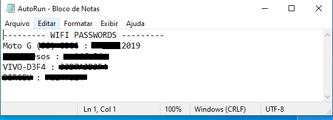

# Get Wifi Passwords
This code collects passwords for WiFi networks already connected in the Windows operating system only (PT-BR).

You can use this code in two ways. The first is to use Python to run getwifipass.py code directly. However in environments that do not have the python interpreter available you can create a Windows executable (.EXE) file of the code "getwifipass.py".

To create your executable (.EXE) file you can use a Python script converter in Windows executable programs that can run without requiring a Python installation. Some converter programs such as py2exe, cx_Freeze, PyInstaller. PyInstaller is recommended and it will be like this converter that we will follow this tutorial.

## PyInstaller Quickstart
To install PyInstaller you can use the following command:
```
python -m pip install pyinstaller
```

Once installed, use the command below in the current repository directory to convert the getwifipass.py file to executable (.EXE).
```
pyinstaller --onefile getwifipass.py
```

If everything is correct so far pyinstaller will create some folders and within "dist / getPass" you will find the executable file ready for use.


